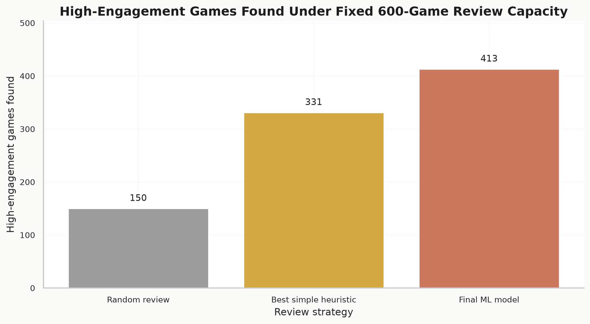
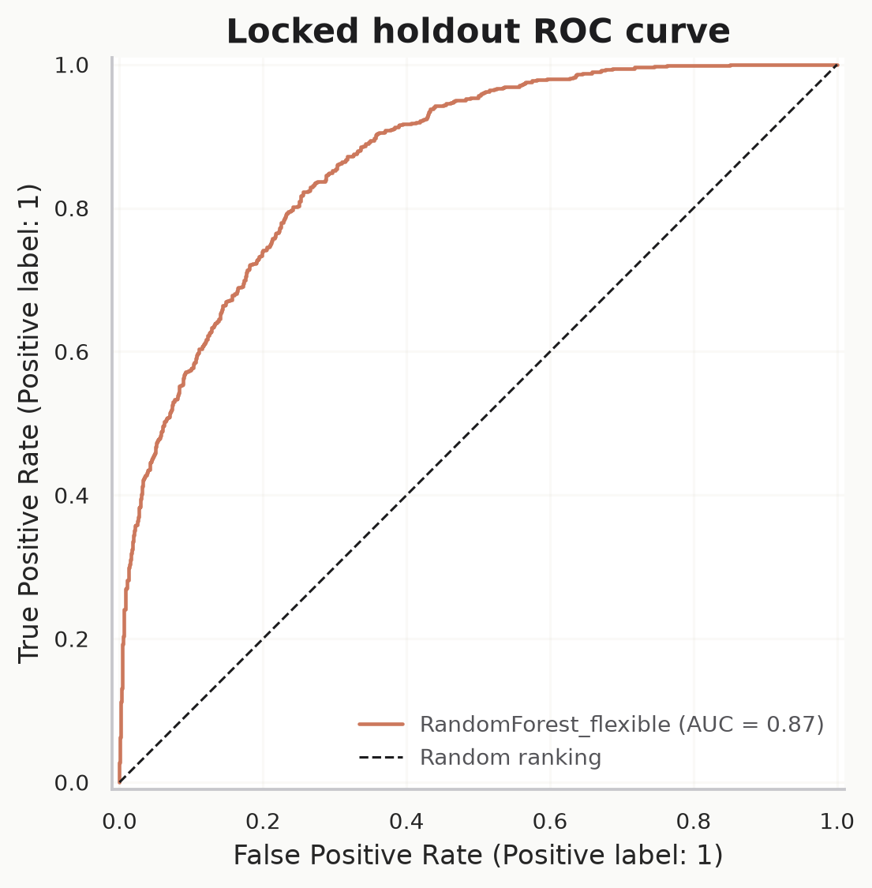
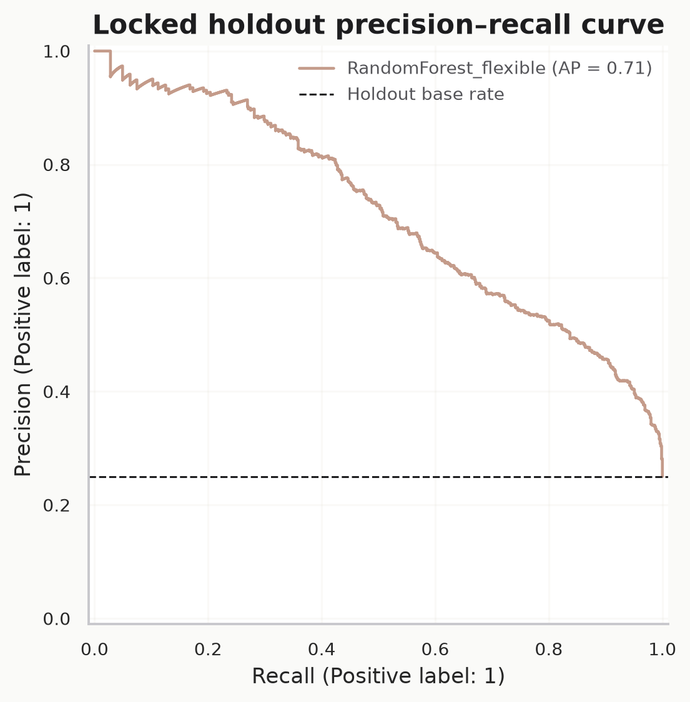
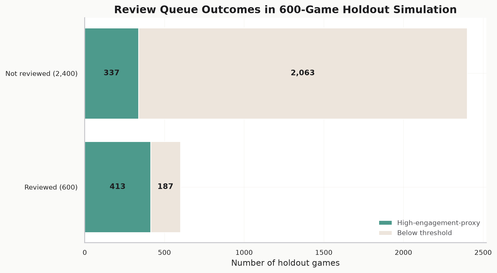
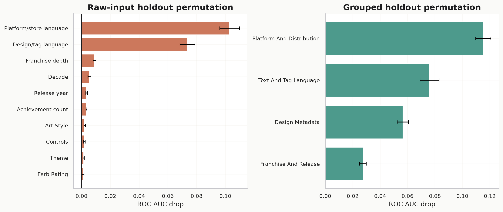
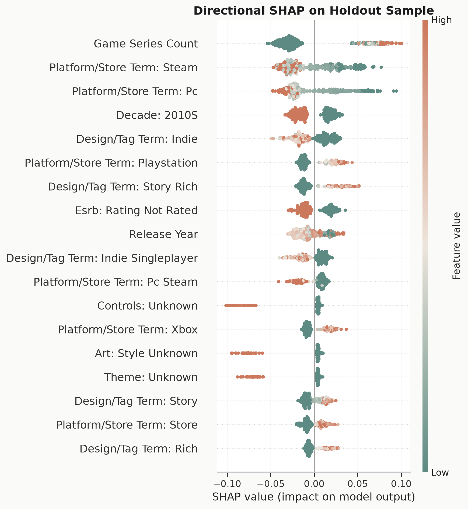

# Game Engagement Prioritisation Analytics

> **Can a game studio use observable market metadata to decide which comparable games deserve analyst review first?**<br>
> An evidence-led product analytics notebook for prioritising high-engagement games under limited review capacity.

[](https://colab.research.google.com/github/chrisnch/game-engagement-prioritisation-analytics/blob/main/notebooks/final_notebook_colab.ipynb)
[](https://chrisnch.github.io/game-engagement-prioritisation-analytics/)

**Repository:** https://github.com/chrisnch/game-engagement-prioritisation-analytics<br>
**Interactive report:** https://chrisnch.github.io/game-engagement-prioritisation-analytics/<br>
**中文版本:** [README.zh-CN.md](README.zh-CN.md)

---

## Why This Project Matters

Indie and AA game studios cannot deeply review every comparable title before making product, platform and marketing decisions. They need a defensible way to focus scarce analyst time on the games most likely to reveal useful engagement patterns.

This project simulates that decision-support problem. It uses a 15,000-game market snapshot to rank games for human comparable-game review. The model is not treated as an automatic success predictor. It is a screening aid that helps analysts decide where to look first, while keeping causality, revenue and audience-fit claims outside the model boundary.

**Core question:** Which observable factors are associated with top-quartile player engagement, and how can a studio use those factors as screening signals without confusing prediction with causation?

---

## Key Result

In a fixed **600-game review queue**, random screening would identify about **150** high-engagement games. The final machine-learning model identifies **413**, adding **263** more useful review candidates while reducing the false review burden from **450** to **187** games.

<p align="center">
  
</p>

The result supports a practical workflow: use the model to prioritise review, then let analysts inspect the shortlisted games for design, audience, platform and market context.

---

## What This Project Demonstrates

| Stage | What I Did |
|---|---|
| **Business framing** | Reframed game engagement modelling as a constrained review-prioritisation decision instead of a generic prediction contest. |
| **Data audit** | Validated the submitted 15,000-row, 43-field Kaggle snapshot, checked duplicate keys, placeholders, nulls and analytical row retention. |
| **Target definition** | Defined `high_engagement` as the top quartile of the supplied `engagement_score`, with threshold sensitivity checks. |
| **Leakage control** | Removed direct target leakage and fitted preprocessing inside train-only modelling pipelines. |
| **Model selection** | Compared stage-matched heuristics and machine-learning models using review-queue lift, not ROC-AUC alone. |
| **Holdout validation** | Locked the final model on a 3,000-game holdout set and reported ROC-AUC, PR-AUC, precision, recall and queue outcomes. |
| **Interpretation** | Used feature importance, SHAP and ablation checks to separate useful screening signals from causal overclaims. |
| **Business recommendation** | Converted model output into a human-in-the-loop review process for product and market analysis. |

### Technical Stack

`Python` · `pandas` · `NumPy` · `scikit-learn` · `SciPy` · `SHAP` · `matplotlib` · `seaborn` · `Jupyter`

---

## Results

### Model Performance

The selected model is `RandomForest_flexible`. On the locked holdout set it reaches:

| Metric | Value |
|---|---:|
| ROC-AUC | **0.869** |
| PR-AUC | **0.715** |
| Precision | **0.566** |
| Recall | **0.723** |
| Balanced accuracy | **0.769** |
| Holdout rows | **3,000** |

<p align="center">
  
  
</p>

### Review-Queue Lift

The strongest business result is not the aggregate classifier score. It is the review-queue lift:

| Review group | Games reviewed | High-engagement games found | Precision | Lift vs random |
|---|---:|---:|---:|---:|
| Top 10% predicted | 300 | 256 | 0.853 | 3.41x |
| Top 20% predicted | 600 | 413 | 0.688 | 2.75x |
| Top 25% predicted | 750 | 469 | 0.625 | 2.50x |

<p align="center">
  
</p>

### What Signals Matter?

Feature importance and SHAP analysis show that the model uses release context, platform breadth, franchise depth, genre/design metadata and text-derived signals. These are useful for screening, but they should not be read as causal levers.

<p align="center">
  
</p>

<p align="center">
  
</p>

### Critical Caveat

The supplied `engagement_score` is an opaque proxy in the local dataset. Its formula, collection date and exposure window are not documented in the submitted artefacts. The notebook therefore treats it as a screening target, not as revenue, retention, player satisfaction or a causal outcome.

---

## Reproducibility

### Run in Google Colab

Use the Colab badge at the top of this README. If Colab cannot locate the repository automatically, open:

```text
https://colab.research.google.com/github/chrisnch/game-engagement-prioritisation-analytics/blob/main/notebooks/final_notebook_colab.ipynb
```

The notebook expects the submitted dataset at:

```text
data/raw/Ultimate_Games_Dataset.csv
```

When opened directly in Colab from GitHub, the Colab notebook installs the declared runtime requirements and clones this public repository if that relative data path is not already available in the runtime.

### Run Locally

```bash
python3 -m venv .venv
. .venv/bin/activate
pip install -r requirements.txt
jupyter lab notebooks/final_notebook.ipynb
```

Running the notebook regenerates `figures/` and `outputs/`. Review those diffs before committing.

---

## Dataset

The analysis uses Rudra Kumar Gupta's Kaggle dataset, **Ultimate Games Dataset | 15K Games | 43 Features**:

```text
https://www.kaggle.com/datasets/rudrakumargupta/ultimate-games-dataset-15k-games-43-features
```

The submitted raw CSV is stored at:

```text
data/raw/Ultimate_Games_Dataset.csv
```

Before making this repository public or redistributing the final zip, re-check the Kaggle dataset licence and course submission rules.

---

## Project Structure

```text
├── README.md                              English project overview
├── README.zh-CN.md                       Simplified Chinese overview
├── index.html                            Bilingual GitHub Pages report
├── notebooks/
│   ├── final_notebook.ipynb              Canonical analysis workflow
│   └── final_notebook_colab.ipynb        Colab launcher with requirements install
├── data/raw/
│   └── Ultimate_Games_Dataset.csv        Submitted raw Kaggle dataset
├── outputs/                              Canonical CSV evidence tables
├── figures/                              Generated visual outputs
├── report/
│   └── final_business_report.md          Business-facing Markdown report
└── requirements.txt                      Runtime dependencies
```

Only final analysis artefacts are included. Scratch notebooks, cache folders, processed datasets, enrichment dumps and old runs are intentionally excluded.

---

## Outputs

Key tables:

- `outputs/model_holdout_metrics.csv`
- `outputs/screening_lift_table.csv`
- `outputs/decision_simulation.csv`
- `outputs/target_threshold_sensitivity.csv`
- `outputs/claim_evidence_action_matrix.csv`

Key figures:

- `figures/decision_simulation_bar_chart.png`
- `figures/review_queue_outcomes.png`
- `figures/feature_importance.png`
- `figures/shap_summary.png`
- `figures/roc_curve.png`
- `figures/precision_recall_curve.png`

---

## Project Context

This repository is a notebook-led analytics submission. The final notebook follows the project narrative: data audit, target definition, modelling, evaluation, interpretation and business recommendation.

The practical recommendation is deliberately conservative: use the model to make human review more efficient, not to automate product strategy.
